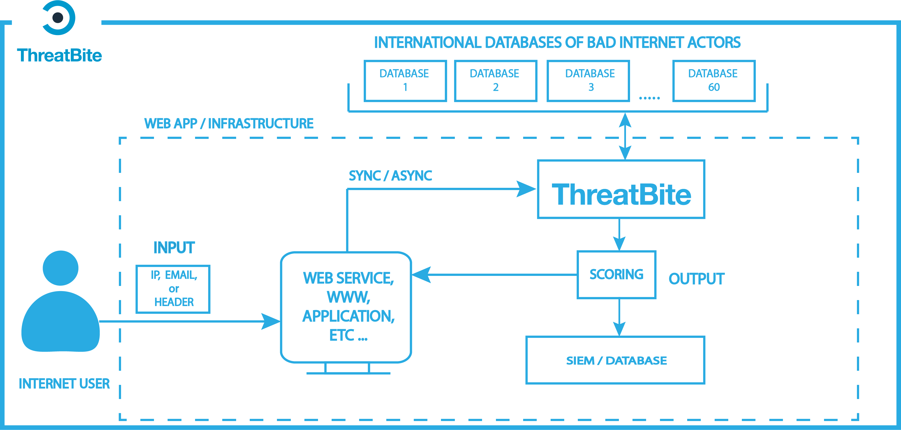

# ThreatBite - reputation checking tool


[](https://goreportcard.com/report/github.com/optimatiq/threatbite)


# About
ThreatBite is a global reputation system used internally by [optimatiq](https://optimatiq.com). It analyses incoming internet users and sends back a standardized score representing their trustworthiness. The program uses independent databases that collect up-to-date information about bad internet actors. Because it is an API service, it works in real-time, allowing you to act fast and block or keep an eye on suspicious user behavior.

# Architecture


# Features

### Identifying the source of threat
ThreatBite identifies potential sources of fraud by comparing user identification data to over 500 databases of bad internet actors.

### Account creation protection
ThreatBite protects against automatic account creation and user account hijacking.

### Spam detection
ThreatBite Identifies potential sources of spammers.

### Tor users detection
ThreatBite recognizes addresses belonging to the Tor network.

### Proxy/VPN
ThreatBite detects addresses that are used as proxys or VPNs.

## Download
- Grab the latest binary from the [releases](https://github.com/optimatiq/threatbite/releases) page and run it:

```shell
./threatbite
```
- Or use the official Docker image:

```shell
docker run -d -p 8080:8080 optimatiq/threatbite
```

- Or get the sources:

```shell
git clone https://github.com/optimatiq/threatbite
cd ./threatbite
make bulid && ./bin/threatbite
```

## Quickstart

### Scoring for email
`curl localhost:8080/v1/score/email/noreply@o2.pl`

### Scoring for IP address
`curl  localhost:8080/v1/score/ip/1.1.1.1`

### Scoring for HTTP request

```
curl \
  -X POST \
  localhost:8080/v1/score/request \
  -H 'Content-Type: application/json' \
  -d '{"ip":"1.2.3.4", "host":"host.pl", "uri":"/", "method":"GET", "user_agent":"curl", "headers": {"x-header": 1}}'
```

or 

```
curl \
  -X POST \
  localhost:8080/v1/score/request \
  -d 'ip=1.2.3.4' \
  -d 'host=host.pl' \
  -d 'uri=/' \
  -d 'method=POST' \
  -d 'user_agent=curl'
```
### API documentation
`chrome localhost:8080`

### Rate limits
10 requests per seconds are allowed, after reaching limit 429 HTTP status code is returned

### Configuration
Configuration is done via env variables or config.env file. All parameters are optional:
* `PORT`       - API listening port default 8080
* `DEBUG`      - values: false, true, 1, 0 or empty
* `AUTO_TLS`   - values: false, true, 1, 0 or empty, automatic access to certificates from Let's Encrypt

License keys for these external services will improve the quality of the results. It is highly recommended to set them.
* `PWNED_KEY`   - obtained from https://haveibeenpwned.com/
* `MAXMIND_KEY` - obtained from https://www.maxmind.com/en/accounts/current/license-key   

Correct communication with the MTA server requires the following settings. Otherwise, the server may close the connection with the error: 
* `SMTP_HELLO` - the domain name or IP address of the SMTP client that will be provided as an argument to the HELO command
* `SMTP_FROM`  - MAIL FROM value passed to the SMTP server

IP/CIDR lists contain information about addresses used as proxy/VPN or other malicious activity. 
You can provide one or many sources separated by whitespace. 
The format of the data is straightforward, and each line contains one IP or CIDR addresses.
Threadbite open-source version provides public sources that are limited in scope and might be outdated with no SLA. 
If you interested in curated and more accurate lists with SLA, please contact us at threatbite@optimatiq.com

* `PROXY_LIST` - URL or set of URLs separated by space, default: https://get.threatbite.com/public/proxy.txt
* `SPAM_LIST`  - URL or set of URLs separated by space, default: https://get.threatbite.com/public/spam.txt
* `VPN_LIST`   - URL or set of URLs separated by space, default: https://get.threatbite.com/public/vpn.txt
* `DC_LIST`    - URL or set of URLs separated by space, default: https://get.threatbite.com/public/dc-names.txt

Email lists contain information about domains used as disposal emails or free solutions which are often used in spam or phishing campaigns.
You can provide one or many sources separated by whitespace. 
The format of the data is straightforward, and each line contains one domain
Threadbite open-source version provides public sources that are limited in scope and might be outdated with no SLA. 
If you interested in curated and more accurate lists with SLA, please contact us at threatbite@optimatiq.com

* `EMAIL_DISPOSAL_LIST`  - URL or set of URLs separated by space, default: https://get.threatbite.com/public/disposal.txt
* `EMAIL_FREE_LIST    `  - URL or set of URLs separated by space, default: https://get.threatbite.com/public/free.txt

### config.env file 
You can store your custom configuration in config.env. The format is defined as below:

```
DEBUG=true
PORT=443
AUTO_TLS=true
PROXY_LIST=https://provider1.com https://provider2.com
```

By default threatbite binary is looking for config.env file in the same directory, 
but you can use `-config` flag to change this and point to any file in a filesystem.

`./bin/threatbite -confg=/etc/threatbite/config.env`

## Development

### Go 
At least version 1.13 is required 

### Building & running
`make bulid && ./bin/threatbite`

### Run tests:
`make test`

### Quality & linteners:
`make check`

### Other targets
`make help`

### Internal endpoints
`/internal/*` endpoints should not be public, they contains sensitive data. 

### Health check
`/internal/health`

### Monitoring
Prometheus endpoint is available at: `/internal/metrics`

### Profiling
`go tool pprof localhost:8080/internal/debug/pprof/profile?seconds=20`

`go tool pprof localhost:8080/internal/debug/pprof/heap`
